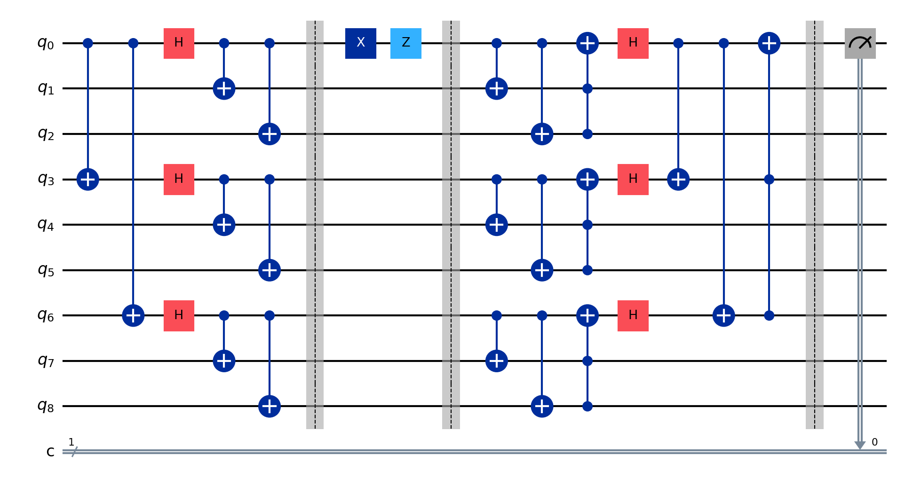
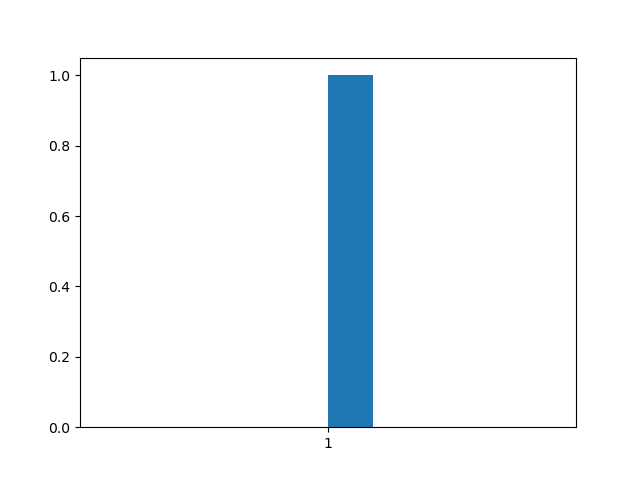

# Shor's 9-Qubit Quantum Error Correction Code

## Overview

The 3-qubit code I built earlier protects a qubit from bit-flip errors but doesn’t address phase flips. Shor’s 9-qubit code is a quantum error correction method that uses nine physical qubits to safeguard one logical qubit against a wider range of errors. It encodes the logical qubit by first using a three-qubit code to detect and correct phase-flip errors, then encoding each of those three qubits with another three-qubit code to handle bit-flip errors. This layered approach, known as concatenation, combines both steps into a single nine-qubit structure, offering protection from any single-qubit error.

## The Circuit

The code identifies and corrects single-qubit errors—bit flips (\(X\)), phase flips (\(Z\)), or their combination (\(XZ\)). For bit flips, it applies CNOT gates within each three-qubit block (e.g., qubits 0-2, 3-5, 6-8) to compare pairs, detecting if one qubit differs from the others; a Toffoli gate then corrects the identified qubit. For phase flips, Hadamard gates transform the qubits from the logical basis to the superposition basis, and CNOT gates across the block leaders (qubits 0, 3, 6) check for phase mismatches, with a Toffoli gate restoring the correct phase. This mechanism ensures any single-qubit error is treated as a bit or phase flip and corrected without disrupting the logical state. After correction, decoding reverses the concatenation to retrieve the original qubit.
The circuit diagram built in Qiskit below shows an initial state setup and measurement:

  

  <i></i>

Below are histograms showing measurement outcomes for initial states $\(|0\rangle\)$ and $\(|1\rangle\)$ after the full error correction process:

  " width="300" style="display:inline-block;"/>
  " width="300" style="display:inline-block;"/>

  <i>Left: Results for initial state |0〉, showing 1000 counts of '0'. Right: Results for initial state |1〉, showing 1000 counts of '1'. These demonstrate the code’s correction ability.</i>

